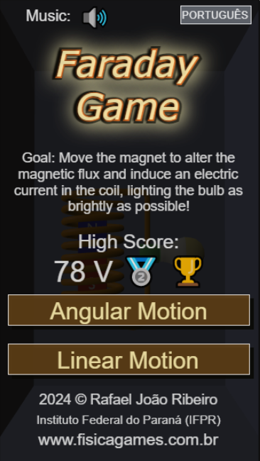
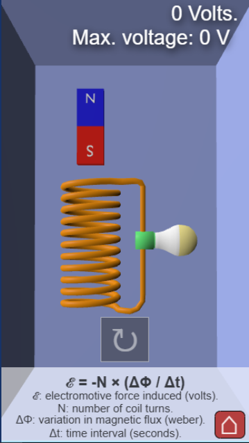
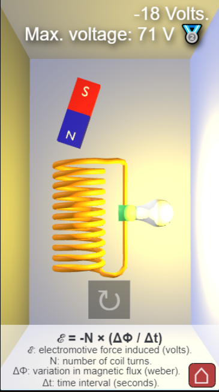
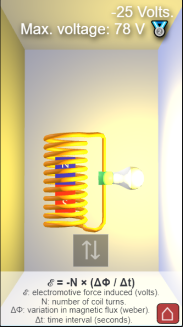

# Faraday Game ⚡

[](https://opensource.org/licenses/MIT)
[](https://www.typescriptlang.org/)
[](https://www.babylonjs.com/)
[](https://vitejs.dev/)

An interactive simulation on Faraday's Law of Electromagnetic Induction, built on a custom MVC framework using Babylon.js.

### [🎮 Play Now!](https://fisicagames.com.br/)

---

## 📄 Table of Contents

* [About the Game](#-about-the-game)
* [Key Features](#-key-features)
* [How to Play](#-how-to-play)
* [Tech Stack](#-tech-stack)
* [Installation and Setup](#-installation-and-setup)
* [Architecture and Technical Highlights](#-architecture-and-technical-highlights)
* [Screenshots](#-screenshots)
* [License](#-license)
* [Author](#-author)

---

## 📖 About the Game

**Faraday Game** is an interactive simulation inspired by Faraday's Law, allowing players to explore electromagnetic induction. The objective is to move a magnet to change the magnetic flux through a coil, inducing electric current and lighting up a lamp. Players test their skills to maximize light intensity and learn about one of the fundamental principles of electromagnetism in a playful and accessible way.

The game demonstrates **Faraday's Law of Electromagnetic Induction**, which states that a change in magnetic flux through a coil generates an electromotive force (EMF), responsible for the electric current. The faster the magnet moves, the greater the change in magnetic flux, resulting in a higher voltage in the coil.

---

## ✨ Key Features

* **Simple Interaction:** Single-button or touch control for accessible and engaging gameplay.
* **Two Game Modes:**
  * **Angular Motion:** The magnet rotates in front of the coil.
  * **Linear Motion:** The magnet moves vertically back and forth, passing through the coil.
* **Score System:** The voltage generated in the coil is converted into a score:
  * 🥉 **Bronze:** 24 V or higher.
  * 🥈 **Silver:** 60 V or higher.
  * 🥇 **Gold:** 110 V or higher.
* **Multilingual:** Native support for Portuguese and English.
* **Easter Egg:** Use multiple touches (mobile) or keys (keyboard) to discover "hack mode" and generate much higher voltages.
* **Photosensitivity Awareness:** Two visual effect modes — **Intense Effects** (full experience with rapid lighting changes) and **Soft Effects** (adapted for users with photosensitive conditions).

---

## 🕹 How to Play

**Objective:** Move the magnet as fast as possible to maximize the generated voltage and light up the lamp at the highest intensity.

#### Controls

💻 **On PC:**

* **[ Spacebar ]** or any key: Activate the magnet motion.
* Multiple key presses: Trigger "hack mode" for extreme voltages.

📱 **On Mobile / Touch:**

* **[ Tap ]** the on-screen button to activate the magnet.
* Multiple touches: Trigger "hack mode".

#### Game Modes

* **Angular:** Rotate the magnet in front of the coil.
* **Linear:** Move the magnet vertically through the coil.

Generate voltages above 24 V to earn medals and challenge your limits.

---

## 🛠 Tech Stack

| Tool                                       | Version | Description                                                              |
| ------------------------------------------ | ------- | ------------------------------------------------------------------------ |
| [TypeScript](https://www.typescriptlang.org/) | 5.7.2   | Core language, providing type safety and robust architecture.            |
| [Babylon.js](https://www.babylonjs.com/)      | 7.5.0   | Graphics engine for 3D rendering, animations, particles, and GUI system. |
| [Vite.js](https://vitejs.dev/)                | 5.2.11  | Build tool for ES6 module compilation, tree-shaking, and optimization.   |
| [Node.js](https://nodejs.org/en)              | 20+     | Development environment and runtime.                                     |

---

## 🚀 Installation and Setup

**Prerequisites:**

* Node.js (v20 or higher)
* NPM (v10 or higher)

**Steps:**

1. Clone the repository.
2. Install dependencies:
   ```sh
   npm install
   ```
3. Start the development server:
   ```sh
   npm run dev
   ```
4. Build for production (generates the `dist` folder):
   ```sh
   npm run build
   ```

---

## 🏗 Architecture and Technical Highlights

The project uses a **custom MVC Framework written in TypeScript**, allowing the simulation to run natively in mobile browsers without requiring full-screen APIs or third-party app installations.

Data flow is organized using the **Model-View-Controller (MVC)** pattern via callbacks:

* **Model:** A render-agnostic layer that computes the induced EMF using a manual approximation of Faraday's Law, derived from the magnet's instantaneous angular or linear velocity relative to the coil.
* **View:** Constructs the interface via Babylon GUI and manages reactive translations (Portuguese / English), updating the UI based on state changes.
* **Controller:** Processes input events and coordinates the physics update cycle, optimizing battery consumption on mobile devices.

The induced voltage is rendered through a real-time light intensity model on the lamp, creating an immediate visual feedback loop between the magnet's motion and the resulting current.

---

## 📸 Screenshots









---

## 📜 License

### Source Code

The source code in this repository is licensed under the **MIT License** — see the [LICENSE](./LICENSE) file.

### Visual Assets

3D models, textures, and original visual content created by the author are licensed under **Creative Commons Attribution 4.0 International (CC BY 4.0)**.

### Audio Assets

Music and sound effects in this project are sourced from [Pixabay](https://pixabay.com/) under the [Pixabay Content License](https://pixabay.com/service/license-summary/), which permits free use including for commercial purposes.

### Third-Party Libraries

* **Babylon.js** — Apache License 2.0
* **Havok Physics** — Per vendor terms (Babylon.js distribution)
* **Vite.js** — MIT License

**Copyright © 2025 Rafael João Ribeiro.**

---

## 👨‍🔬 Author

Developed by:
**Prof. Dr. Rafael João Ribeiro**
Federal Institute of Paraná (IFPR)
[www.fisicagames.com.br](https://www.fisicagames.com.br)

---
